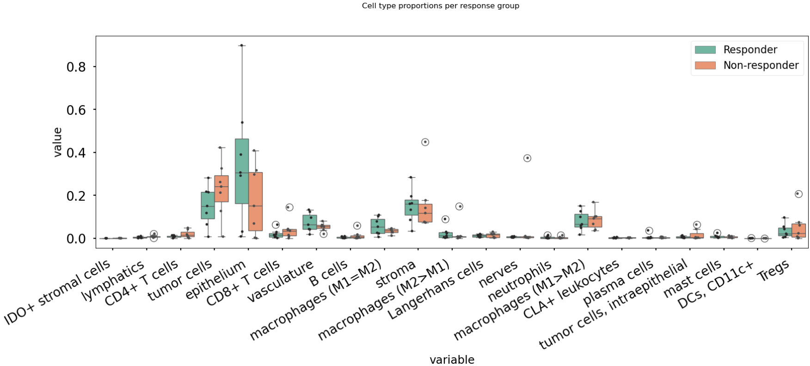
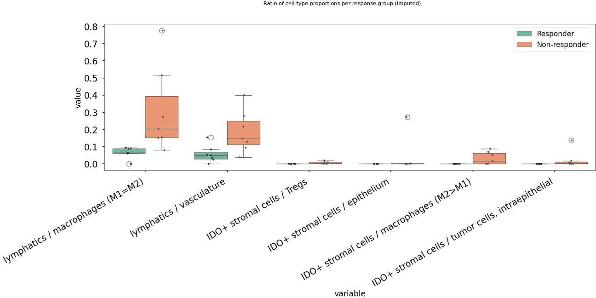
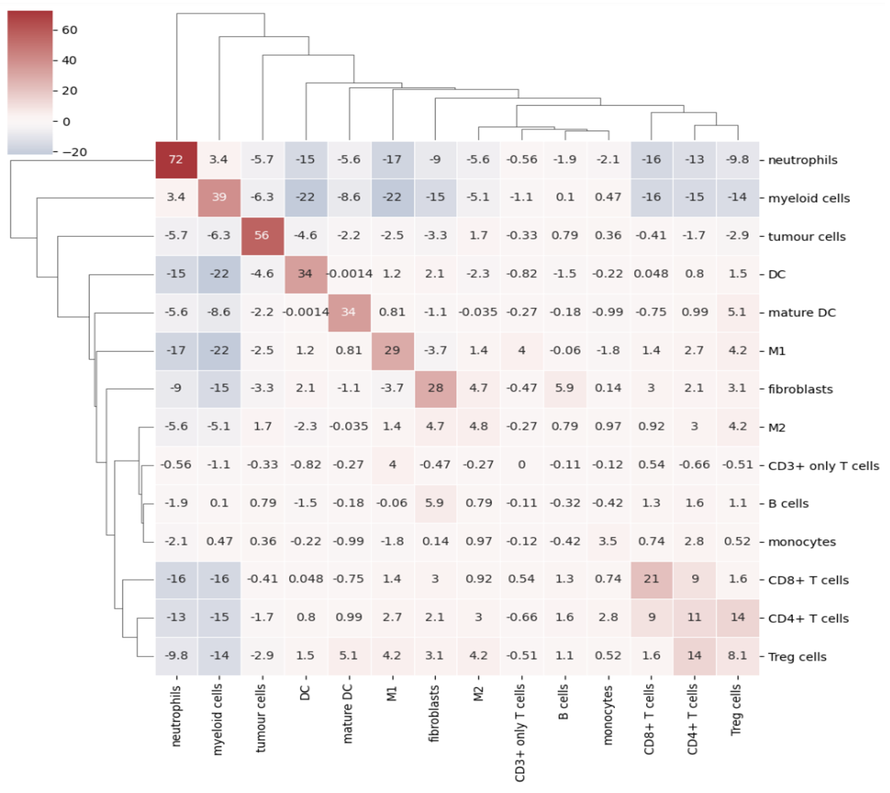

How to Guides
=============

Mosna proposes a pipeline to explore increasingly complex features in relation with clinical data.
It can be used to extract and visualize descriptive statistics, and to identify features that are most
predictive of clinical variables, by training machine learning models.
In particular, the following features are explored, in order of increasing complexity:

- Proportional abundance of cellular phenotypes, and proportional abundance ratios (composition)
- Preferential interractions between different phenotypes, quantified with assortativity z-scores (network topology)
- Cellular niches

Mosna leverages the tysserand library to discover patterns of cellular interaction that are potentially clinically relevant.
In this how-to guide we discuss how to:

- generate and visualize spatial networks with tysserand
- calculate assortativity scores that quantify preferential interactions with mosna
- generate mixing matrices with mosna
- identify and visualize cellular niches with mosna (to do)

Generate and Visualize Spatial Networks
---------------------------------------

Tysserand generates computational networks that can subsequently be analyzed with mosna.
To generate such networks with tysserand, we need to provide it with the spatial coordinates of the nodes, which can either be individual cells
or spots (such as in Visium 10X genomics). The nodes should be provided as a numpy array of shape ``(n_nodes, 2)``, where the first column contains the
x-coordinates and the second column contains the y-coordinates \footnote{It is also possible to provide 3D coordinates}.
Assuming we have a pandas dataframe ``group`` with columns ``X_position`` and ``Y_position`` that specify the spatial coordinates of the nodes, 
we can use the following code to generate the network:

.. code-block:: console

  df_nodes = group[['X_position', 'Y_position']]
  df_nodes.columns = ['X_position', 'Y_position']
  np_array_nodes = df_nodes.values
  np_array_edges = ty.build_delaunay(np_array_nodes)

The function ``build_delaunay`` calculates the edges of the network based on the physical distance of the nodes using the Delaunay triangulation.

**Adaptive Edge Trimming**

Next, we will clean the network from reconstruction artifacts. In particular,
we will remove long-distance connections, which are unlikely to represent real cellular interactions.
For this purpose, we leverage tysserand to perform adaptive edge trimming.

.. code-block:: python

  pairs = ty.build_delaunay(
        coords, 
        node_adaptive_trimming=True, 
        n_edges=3, 
        trim_dist_ratio=2,
        min_dist=0, 
        trim_dist=150,
    )

- ``node_adaptive_trimming=True`` enables the removal of edges based on distance
- ``n_edges=3`` ensures that each node has at least 3 connections
- ``trim_dist`` defines the maximum allowed edge length, in this case 150
- ``trim_dist_ratio=2`` sets distance ratio to help define which edges need to be removed

With ``trim_dist_ratio`` set to two, as in the example above, any edge with length above twice the third shortest edge are removed.

**Color Mapping**

Given a set of unique attributes (e.g. phenotypes) ``uniq``, we can generate a color mapping as follows.

.. code-block:: python

  clusters_cmap = mosna.make_cluster_cmap(uniq)
  celltypes_color_mapper = {x: clusters_cmap[i % n_colors] for i, x in enumerate(uniq)}

When visualizing the network, this color mapping will be used to give each node a color that corresponds to its attribute (e.g. phenotype)

**Handling Isolated Cells**

Solitary nodes can be removed as follows:

.. code-block:: python

  pairs = ty.link_solitaries(np_array_nodes, np_array_edges, method='delaunay', min_neighbors=3)

**Visualization of Network**

Now we are ready to plot the network using tysserand's built-in plotting functionality:

.. code-block:: python

  # By calculating the distances, we can use the distance as a color-mapper.
  distances = ty.distance_neighbors(np_array_nodes, np_array_edges)

  ty.plot_network_distances(
        np_array_nodes, 
        np_array_edges, 
        distances, 
        labels=df_cluster_id, 
        figsize=(100,100)     # The resolution of the resulting image depends on this. Notice that (100, 100) will generate a very detailed network, 
                              # but may require significant computational time for generating the network.
        legend_opt={'fontsize': 52, 'bbox_to_anchor': (0.96, 1), 'loc': 'upper left'},
        size_nodes=60,
        color_mapper=color_mapper,
        cmap_nodes=cmap_nodes,
        ax=ax  # Ensure you pass the axis here
    )

.. image:: images/img1_tysserand_network.png
   :alt: Example result
   :width: 94%
   :align: center

.. raw:: html

     
     
     

Data Transformation and Batch Correction
----------------------------------------

To normalize marker expression data, we can apply centered log-ratio (CLR) transformation:

.. code-block:: python

    obj_transfo = mosna.transform_data(
    data=obj, 
    groups=sample_col,
    use_cols=marker_cols,
    method='clr')

- ``groups=sample_col`` creates groups to ensure that the transformations are applied to each sample separately
- ``use_cols=marker_cols`` specifies which columns contain marker expression data (as only these need to be normalized)

**Visualization for Quality Control**

Next, we generate a simple histogram for quality control

.. code-block:: python

  obj_transfo[marker_cols].hist(bins=50, figsize=(20, 20));

**Network Node Transformation and aggregation**

We apply the same correction to the network node data. Then we aggregate the nodes

.. code-block:: python

  nodes_dir = mosna.transform_nodes(
      nodes_dir=nodes_dir,
      id_level_1='patient',
      id_level_2='sample', 
      use_cols=marker_cols,
      method='clr',
      save_dir='auto',
  )
  nodes_agg = mosna.aggregate_nodes(
      nodes_dir=nodes_dir,
      use_cols=marker_cols,
  )

This combines all the nodes in the transformed network into a single data set. We can then assess and correct batch effects.

**Dimensionality reduction**

We create a UMAP for visual assessment of the batch effects, before correcting them.

.. code-block:: python

  embed_viz, _ = mosna.get_reducer(nodes_agg[marker_cols], nodes_dir)
  fig, ax, color_mapper = mosna.plot_clusters(
      embed_viz, 
      cluster_labels=nodes_agg['patient'], 
      save_dir=None,
      return_cmap=True,
      show_id=False,
  )

  fig, ax, color_mapper = mosna.plot_clusters(
      embed_viz, 
      cluster_labels=nodes_agg['sample'], 
      save_dir=None,
      return_cmap=True,
      show_id=False,
  )

**Batch Effect Correction**

Now we can apply the batch effect correction. In this step, the systematic differences between patients/samples are removed,
while preserving the present biological variation.

.. code-block:: python

  nodes_dir, nodes_corr = mosna.batch_correct_nodes(
      nodes_dir=nodes_dir,
      use_cols=marker_cols,
      batch_key='patient',
      return_nodes=True,
  )

Comparing Response Groups - Composition
---------------------------------------

Mosna can help identify differences in the immune landscape between the groups, through comparisons between response groups.
As outlined earlier, we will compare increasingly complex characteristics (compositional differences -> assortativity -> niches)
We will start by comparing compositional differences.
In our example, we compare two groups: responders, and non-responders.
We make use of a spatially resolved proteomic data set of Cutaneous T-Cell Lymphoma (CTCL), which was generated using CODEX technology on 70
samples from 14 different patients [1]_. Of these patients, 7 responded, and 7 did not respond to treatment with anti-PD-1 immunotherapy [1]_.

**Differential Analysis between Response Groups**

First, we will investigate how compositional differences are associated to differences in response.
To do so, we start by defining the response and non-response groups:

.. code-block:: python

  group_names = {1: "responder", 2: "non-responder"}

Next, we add attributes to nodes by creating binary indicator variables for each cell type. This enables us to filter and color network visualizations
in subsequent steps.

.. code-block:: python

  nodes_all = obj[pos_cols + [pheno_col]].copy()
  nodes_all = nodes_all.join(pd.get_dummies(obj[pheno_col]))
  uniq_phenotypes = nodes_all[pheno_col].unique() 

Then, we use ``patient_col`` to aggregate statistics per patient and condition:

.. code-block:: python

  count_types = obj[[patient_col, group_col, 'Count']].join(nodes_all[pheno_col]).groupby([patient_col, group_col, pheno_col]).count().unstack()
  count_types.columns = count_types.columns.droplevel()
  count_types = count_types.fillna(value=0).astype(int)

Subsequently, we count cell types, and calculate the proportional cell type abundances.

.. code-block:: python

  total_count_types = count_types.sum().sort_values(ascending=False)
  prop_types = count_types.div(count_types.sum(axis=1), axis=0)
  total_prop_types = total_count_types / total_count_types.sum()

We are now ready to perform the differential analysis between response groups, using mosna's ``find_DE_markers`` function.

.. code-block:: python

  pvals = mosna.find_DE_markers(prop_types, group_ref=1, group_tgt=2, group_var=group_col)

Now that we have calculated the p-values, which are corrected for the false discovery rate (FDR), we can visualize the differences between different patient groups.

.. code-block:: python

  fig, ax = mosna.plot_distrib_groups(
      prop_types, 
      group_var=group_col,
      groups=[1, 2], 
      pval_data=pvals, 
      pval_col='pval', 
      max_cols=-1, 
      multi_ind_to_col=True,
      group_names=group_names,
      )
  fig.suptitle("Cell type proportions per response group", y=1.0);

An example result is shown in the image below:

In this case, there are no significant differences in cell-type abundance between the response and non-response groups.

**Proportional Abundance Ratios**

Still considering composition, we will now introduce the next level of complexity: proportional abundance ratios.
Two individually non-significant differences in proportional abundance between the response and non-response groups may combine into
a significant shift in their ratio, especially when abundance ratios share correlated noise that cancels out.

To compare ratios of proportional abundance, we can use mosna's ``make_composed_variables()`` function. 

.. code-block:: python

  composed_variables = mosna.make_composed_variables(prop_types, method='ratio', order=1)
  prop_types_comp = pd.concat([prop_types, composed_variables], axis=1)
  pvals = mosna.find_DE_markers(prop_types_comp, group_ref=1, group_tgt=2, group_var=group_col)

We clean up the data, removing NaNs, imputing missing values:

.. code-block:: python

  prop_types_comp_cleaned, select_finite = mosna.clean_data(
    prop_types_comp, 
    method='mixed',
    thresh=0.9,
    )

As before, we can now leverage mosna's ``find_DE_markers`` function, now on the ratios of proportional cell type abundance.

.. code-block:: python

  pvals_cleaned = mosna.find_DE_markers(prop_types_comp_cleaned, group_ref=1, group_tgt=2, group_var=group_col)

Now we can again compare the groups:

.. code-block:: python

  fig, ax = mosna.plot_distrib_groups(
      prop_types_comp_cleaned, 
      group_var=group_col,
      groups=[1, 2], 
      pval_data=pvals_cleaned, 
      pval_col='pval', 
      max_cols=20, 
      multi_ind_to_col=True,
      group_names=group_names,
      )
  fig.suptitle("Ratio of cell type proportions per response group (imputed)", y=1.0);

This results in the following figure, which includes significant differences between responders/non-responders only:

Now we find 6 significant differences in propotional abundance ratios between responders and non-responders.

**Second Order Ratios**

Additionally, second order ratios (i.e. the ratios of proportional abundance ratios) can be calculated using a similar approach.
Again, we use mosna's ``make_composed_variables`` function, but now we set the order parameter to 2.

.. code-block:: python

  composed_variables = mosna.make_composed_variables(prop_types, method='ratio', order=2)
  prop_types_comp = pd.concat([prop_types, composed_variables], axis=1)
  pvals = mosna.find_DE_markers(prop_types_comp, group_ref=1, group_tgt=2, group_var=group_col)

When producing second order ratios, equivalent and inverse ratios are avoided.
For example, (a/b)/(c/d) is included, but (a/c)/(b/d) not, as this would be the inverse.
(a/b)/(a/d) will be excluded, as it simplifies to (d/b), which is a first order ratio.

Subsequently, the same code as before can be used to visualize differences in second order ratios between groups.

Higher order ratios are currently not incorporated.

**Mixing Matrices Intermezzo - An Example**

After looking at the fractional cell abundances, we move towards the next step of complexity:
patterns of preferential interactions between cell-types.
Assortativity analysis in mosna allows you to quantify preferential interactions between nodes with different attributes (e.g. cell types).
Moreover, z-scores can be calculated to show the statistical significance of these preferential interactions.
These assortativity z-scores can be ordered in a mixing matrix.
Before incorporating assortativity in our comparison between response and non-response groups,
we will first discuss an example of a mixing matrix, which is shown below.
In this example we make use of IMC data of 7 patients, in which cellular phenotypes have been assigned as attributes to the nodes.

In a mixing matrix, the attributes (phenotypes) are placed on both the x- and the y-axis.
Each cell in the matrix represents the assortativity z-score between the corresponding attributes.
In our example above, for example, neutrophils are preferentially interacting amongst themselves (top left cell),
whereas neutrophils and regulatory T-cells show avoidant behavior (bottom left cell).

To generate these mixing matrices, mosna makes use of the functions ``mixing_matrix()`` and ``count_edges_directed()``.
The ``mixing_matrix()`` function initializes the mixing matrix, and requires three main arguments:

- **nodes**: A pandas DataFrame containing one-hot-encoded attributes for each node in the network
- **edges**: A pandas DataFrame containing edge information with two columns named 'source' (node 1) and 'target' (node 2)
- **attributes**: A list containing all unique attributes (e.g., cell phenotypes, cluster labels) to analyze

.. code-block:: python

    # Example usage of mixing_matrix function
    mixmat = mosna.mixing_matrix(
        nodes=nodes_df,
        edges=edges_df,
        attributes=phenotype_list
    )

**Important**: The edges DataFrame must contain exactly two columns named 'source' and 'target'. The ``mixing_matrix()`` function uses these names internally, so they cannot be changed.

Furthermore, it is important to keep the following requirements on the input data in mind:

- **One-hot encoding**: Node attributes must be one-hot encoded in the nodes DataFrame
- **Consistent indexing**: The node indices in the edges DataFrame must correspond to the row indices in the nodes DataFrame
- **Unique attributes**: The attributes list should contain all unique phenotypes or cluster labels you want to analyze

Subsequently, we can populate the mixing matrix as follows:

.. code-block:: python

    # For each attribute combination (i, j)
    mixmat[i, j] = count_edges_undirected(
        nodes, 
        edges, 
        attributes=[attributes[i], attributes[j]]
    )

Comparing Response Groups - Assortativity
-----------------------------------------

References
----------

.. [1] Phillips, D., Matusiak, M., Gutierrez, B. R., Bhate, S. S., Barlow, G. L., Jiang, S., ... & Nolan, G. P. (2021). Immune cell topography predicts response to PD-1 blockade in cutaneous T cell lymphoma. Nature communications, 12(1), 6726.
