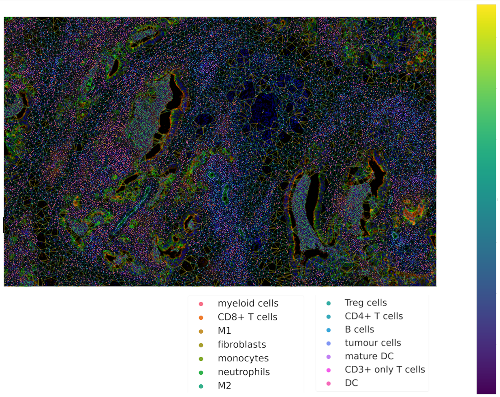

How to Guides
=============

Tysserand
---------

Tysserand generates computational networks that can subsequently be analyzed with mosna.
To generate such networks with tysserand, we need to provide it with the spatial coordinates of the nodes, which can either be individual cells
or spots (such as in Visium 10X genomics). The nodes should be provided as a numpy array of shape ``(n_nodes, 2)``, where the first column contains the
x-coordinates and the second column contains the y-coordinates \footnote{It is also possible to provide 3D coordinates}.
Assuming we have a pandas dataframe ``group`` with columns ``X_position`` and ``Y_position`` that specify the spatial coordinates of the nodes, 
we can use the following code to generate the network:

.. code-block:: console

  df_nodes = group[['X_position', 'Y_position']]
  df_nodes.columns = ['X_position', 'Y_position']
  np_array_nodes = df_nodes.values
  np_array_edges = ty.build_delaunay(np_array_nodes)

The function ``build_delaunay`` calculates the edges of the network based on the Delaunay triangulation of the nodes.
Now we are ready to plot the network using tysserand's built-in plotting functionality:

.. code-block:: python

  # By calculating the distances, we can use the distance as a color-mapper.
  distances = ty.distance_neighbors(np_array_nodes, np_array_edges)

  ty.plot_network_distances(
        np_array_nodes, 
        np_array_edges, 
        distances, 
        labels=df_cluster_id, 
        figsize=(100,100), 
        legend_opt={'fontsize': 52, 'bbox_to_anchor': (0.96, 1), 'loc': 'upper left'},
        size_nodes=60,
        color_mapper=color_mapper,
        cmap_nodes=cmap_nodes,
        ax=ax  # Ensure you pass the axis here
    )

Calculating Assortativity with mosna
------------------------------------

test

.. code-block:: python

  print("a")

